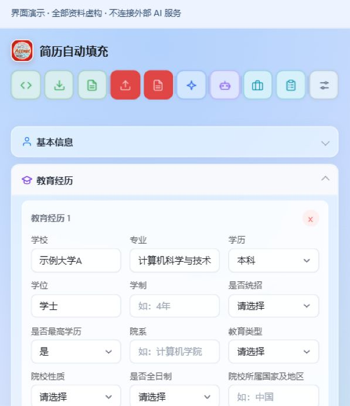
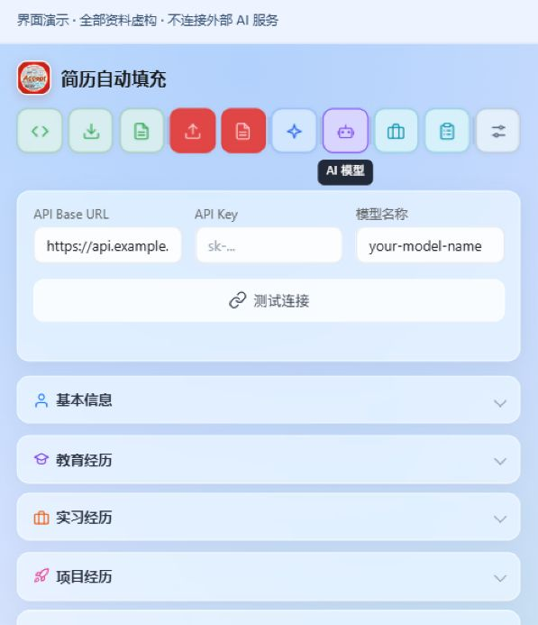

#  简历助手 · Resume Autofill

把一份结构化简历，用到不同招聘网站；把每次投递与后续待办，放在同一个地方。

简历助手是面向中文网申场景的 Chrome / Edge 扩展，采用 Manifest V3。它先用浏览器内的规则匹配表单，再按需调用用户配置的 AI 接口处理未匹配字段，同时提供简历管理、手动推荐和投递进度管理。

# 开源版使用项目不需要注册项目账号，也不需要部署项目服务器。

## 功能预览

从维护简历、填写网申，到记录投递和跟进待办，在一个扩展中完成。下方截图展示项目实际界面，人物、联系方式、经历与企业均为虚构演示资料；开源版首次使用仍为空白简历。

### 1. 简历管理：维护一次，重复使用

按基本信息、教育、实习、项目等分类维护资料，多段经历可以独立增删和编辑。支持 JSON / HTML 导入导出，让不同招聘页面使用同一份结构化简历，减少重复整理。

### 2. 自动填充：先用本地规则处理整页表单

打开可识别的招聘表单后，点击“自动填充”，按字段含义、经历区块和已有网站规则填写。完成后查看填写报告，继续处理未匹配或未通过核验的字段；最终由你核对并保存或提交。

### 3. 大模型填充：为难匹配字段提供可选辅助

在“AI 模型”中配置 API Base URL、API Key 和模型名称，本地规则未匹配的字段可交给模型辅助识别；PDF 导入也使用配置的模型整理提取出的文本。无需 AI 的规则填充和输入框推荐可以单独使用。

*图中展示配置入口，没有执行真实模型请求，也没有使用真实 API Key。启用 AI 后，字段上下文与简历信息会发送至你配置的服务，详见 [数据与隐私](#数据与隐私)。*

### 4. 输入框自动推荐：按字段选择，也能连续追加

点击输入框，即可查看相关简历内容；开启“自动推荐”时，匹配后可自动写入，也可关闭开关后手动点选。开启“追加填写”，可把多条技能、奖励或项目说明组合进同一个文本框；“记住对应”可保存当前网站的字段规则。

### 5. 投递记录：把网申进度与后续待办放在一起

从“记录当前职位”预填记录，或在投递记录页手动新建，统一查看企业、岗位、日期与状态，按需筛选并导入导出 CSV。为测评、笔试、面试设置截止时间，完成待办后同步对应投递状态；恢复待办时按规则回退，便于持续跟进。

### 6. 一份资料，多种导入方式

| 操作           | 支持范围                                   |
| ------------ | -------------------------------------- |
| 手动编辑         | 基本信息、教育、实习、项目、论文、专利、奖励、语言、家庭信息、求职意向等   |
| JSON 导入 / 导出 | 结构化简历备份与迁移；导出不含 API Key                |
| HTML 导入 / 导出 | 支持可识别结构的简历 HTML；可导出便于浏览和打印的 HTML       |
| PDF 导入       | 本地提取 PDF 文本，再调用配置的 AI 接口整理为简历字段；不含 OCR |
| 简历恢复         | 保留最近 3 份导入或恢复前的快照，包含照片；不包含 API Key     |

需要 PDF 文件时，可打开导出的 HTML，通过浏览器打印功能另存为 PDF。项目没有单独的 PDF 导出引擎。

恢复快照只恢复简历资料，不修改投递记录、模型配置和网站规则。

### 

## 快速开始

### 1. 加载扩展

准备支持 Manifest V3 的 Chrome 或 Edge，以及用于打包的 Node.js。

1. 打开浏览器的扩展管理页面：Chrome 为 `chrome://extensions`，Edge 为 `edge://extensions`。

2. 开启“开发者模式”，选择“加载已解压的扩展程序”。

3. 选择刚生成的 **`resume-autofill-extension`** 文件夹，将扩展固定到工具栏。

更新代码后，重新运行打包命令，在扩展管理页点击重新加载，并刷新已经打开的招聘页面。

### 2. 建立自己的简历

点击扩展图标，录入资料或导入自己的 JSON / HTML 简历。

填写时保持各类经历顺序与目标页面一致，尤其是多段教育、实习、项目及论文记录。只录入网申实际需要的信息。

### 3. 按需配置 AI

打开“AI 模型”设置，填写 **API Base URL、API Key、模型名称**，保存后测试连接。

扩展使用兼容 **Chat Completions** 的接口，在 Base URL 后追加 `/chat/completions`。Base URL 应填写服务提供方给出的 API 基础路径，不要重复包含该后缀。模型和服务需要支持本项目使用的请求参数及 JSON 文本结果；接口形式兼容不代表所有模型都保证可用。

AI 由用户选择的服务提供，相关费用和数据处理规则由该服务决定。

### 4. 填写、核对、记录

1. 打开招聘网站的简历填写页，点击出现的“自动填充”按钮。
2. 查看“填写结果”，处理未匹配或未通过核验的字段；也可逐项使用手动推荐。
3. 核对日期、下拉选项、经历归属和必填项，再由自己保存或提交申请。
4. 在相关页面点击“记录当前职位”，核对投递记录并设置后续待办。

## 数据与隐私

### **本地优先不等于所有功能都离线。**

### 项目没有自建简历后台，当前代码没有接入分析统计或遥测服务，但使用 AI 功能会向你配置的接口发送数据。

| 场景                      | 数据去向                                                         |
| ----------------------- | ------------------------------------------------------------ |
| 简历、投递记录、网站规则、设置、API Key | 保存在当前浏览器的扩展本地存储；简历快照保存在扩展的 IndexedDB                         |
| 本地规则与手动推荐               | 在浏览器内匹配；写入目标网页后，该网站可以读取相应内容                                  |
| AI 填充                   | 发送待识别字段的标签、上下文、选项、记录归属等，以及简历信息；普通模式可能包含整份非空简历，增强模式也可能回退到整份简历 |
| PDF 导入                  | 向配置的 AI 接口发送本地提取出的简历文本                                       |
| 记录当前职位的 AI 辅助           | 可能发送当前页面标题、URL、正文片段、表格及规则识别出的岗位候选                            |
| 导出文件与调试日志               | 文件可能包含简历、照片、投递和联系方式；日志可能含字段值，需要自行妥善处理                        |

## 许可证

项目代码采用 [MIT License](LICENSE)。
